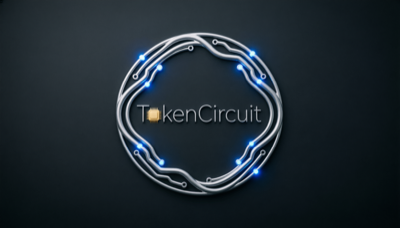

# TokenCircuit

<p align="center">
  
</p>

<p align="center">
  <b>The Pre-Model Intervention Engine for Autonomous Agents.</b>
</p>

<p align="center">
  <a href="https://pypi.org/project/tokencircuit/">
    
  </a>
  <a href="https://pypi.org/project/tokencircuit/">
    
  </a>
  <a href="https://github.com/Devaretanmay/TokenCircut/actions">
    
  </a>
  <a href="LICENSE">
    
  </a>
  <a href="tests/performance/">
    
  </a>
</p>

---

<p align="center">
  
</p>

Most guardrails are blunt instruments. They wait for your agent to burn $50 in API
credits, hit a hard `recursion_limit`, and crash—wiping the state and returning an
error to your user.

**TokenCircuit** is a surgical, pre-model intervention layer. Using zero-dependency
semantic shingling, it detects paraphrased loops *before* the next LLM call.
Instead of just killing the run, it uses a **Progressive Intervention Protocol**
(Nudge → Override → Hard Stop) to safely rewrite the transcript and force the
agent to pivot strategies.

> **< 20µs overhead per turn.** Zero network calls. 100% local.

## Key Features

*   **Progressive Intervention Protocol**: Escalates from a *Nudge* (soft coaching
    injection) to an *Override* (surgical transcript compaction) before a *Hard Stop*
    (clean termination with state preserved).
*   **Zero-Dependency Semantic Loop Detection**: Shingle-based fingerprinting catches
    paraphrased loops without embedding models, tokenizers, network calls, or external APIs.
*   **Atomic Transcript Surgery**: Removes orphaned tool-call transactions to prevent
    LLM API validation errors (400 Bad Request) before they happen.
*   **Zero-Trust Privacy**: Every detection runs in your process. No telemetry,
    no prompts leave your RAM.

## Quick Start

TokenCircuit natively integrates with LangGraph v1.0.8+ through official
extension points—no monkey-patching required.

```python
from langgraph.prebuilt import ToolNode, create_react_agent
from tokencircuit import InterventionEngine
from tokencircuit.adapters.langgraph import tc_pre_model_hook, tc_wrap_tool_call

engine = InterventionEngine()
safe_tools = ToolNode(tools, wrap_tool_call=tc_wrap_tool_call(engine.get_thread_ledger))
agent = create_react_agent(
    model,
    tools=safe_tools,
    pre_model_hook=lambda s: tc_pre_model_hook(s, engine=engine),
)
```

The hook intercepts the agent *before* each LLM call, runs the intervention
pipeline (~20µs), and returns ephemeral message mutations. No graph state
is modified—the original checkpoint remains clean.


### Manual graph with named hooks
```python
from tokencircuit import InterventionConfig, InterventionEngine
from tokencircuit.adapters.langgraph import tc_pre_model_hook

engine = InterventionEngine(config=InterventionConfig(...))
builder.add_node(
    "agent", call_model,
    pre_model_hook=lambda s: tc_pre_model_hook(s, engine=engine, node_name="agent"),
)
```

## Universal Framework Support

TokenCircuit's core engine is 100% zero-dependency. Framework adapters are strictly isolated as optional dependencies to protect your supply chain.

### CrewAI
```bash
pip install "tokencircuit[crewai]"
```
```python
from crewai import Crew, Agent, Task
from tokencircuit.adapters.crewai import instrument_crewai

my_crew = Crew(agents=[...], tasks=[...])
safe_crew = instrument_crewai(my_crew, config=my_config)
safe_crew.kickoff()
```

### Raw OpenAI / AsyncOpenAI
```bash
pip install "tokencircuit[openai]"
```
```python
from openai import OpenAI
from tokencircuit.adapters.openai import TokenCircuitClient

client = TokenCircuitClient(OpenAI(), config=my_config)
# Drop-in replacement. Loops are intercepted before the HTTP request.
response = client.chat.completions.create(...)
```

## Installation

```bash
pip install tokencircuit                    # Core engine
pip install "tokencircuit[langgraph]"       # + LangGraph adapter
pip install "tokencircuit[crewai]"          # + CrewAI adapter
pip install "tokencircuit[cli]"             # + TUI Dashboard
```

## Performance

Benchmarked on the full intervention pipeline:

| Scenario | Latency |
|---|---|
| `decide()` hot path (PASS) | ~1.4 µs |
| `decide()` with NUDGE | ~3.5 µs |
| `process()` full pipeline | ~20 µs |
| `process()` with tool calls | ~33 µs |

Zero external embedding dependencies. All detection is local shingle-based
fingerprinting.

## Production Audit & Mathematical Guarantees

TokenCircuit was built for zero-trust, high-throughput enterprise environments. It undergoes ruthless structural auditing to ensure it never crashes an agent or corrupts state.

*   **Zero PII Telemetry**: Telemetry is strictly isolated to integers and enum metadata. A mathematical proof in the payload compiler ensures that raw user prompts, tool arguments, and tool results are structurally excluded and cannot leak.
*   **Bounded Algorithm Complexity**: The semantic loop detector uses stdlib tokenization and guarantees a worst-case shingle comparison complexity of `O(N)`. A hard cap on the sliding window prevents CPU algorithmic blowups even on massive multi-turn infinite loops.
*   **Atomic Transcript Surgery**: TokenCircuit adheres strictly to LangGraph v1.0.8+ API boundaries. Stray, duplicate, or dangling tool calls resulting from an intervention are surgically stripped from the LLM prompt, definitively eliminating OpenAI/Anthropic `400 Bad Request` API errors.
*   **Async & Event-Loop Safety**: All metrics fire asynchronously in daemon threads. Core pre-model hooks and interceptors run perfectly synchronously, ensuring they never starve or block the primary application event loop.

## Supported Frameworks

*   **LangGraph**: Native `pre_model_hook` and `ToolNode(wrap_tool_call=...)` integration (v1.0.8+).
*   **CrewAI**: Execution hook support (`crewai>=0.60`) for proactive
    intervention.
---

<p align="center">
  Built for the 2026 Agentic Economy.
</p>
